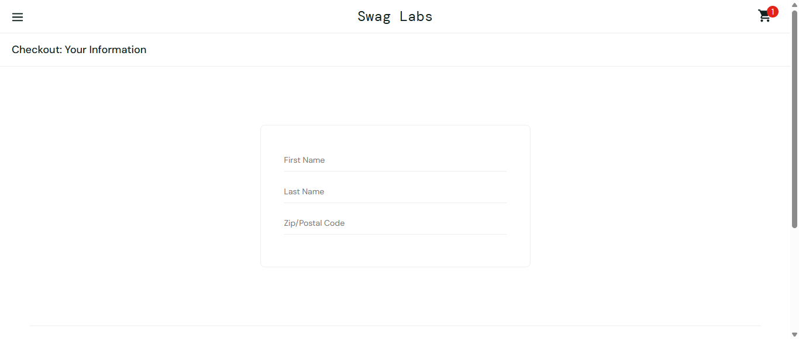
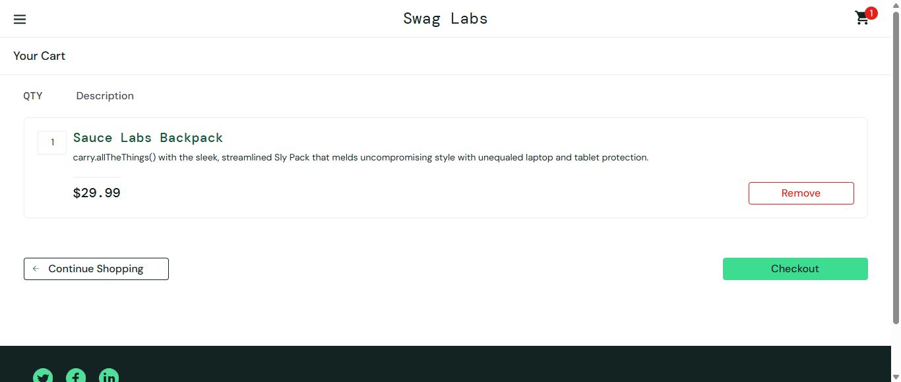
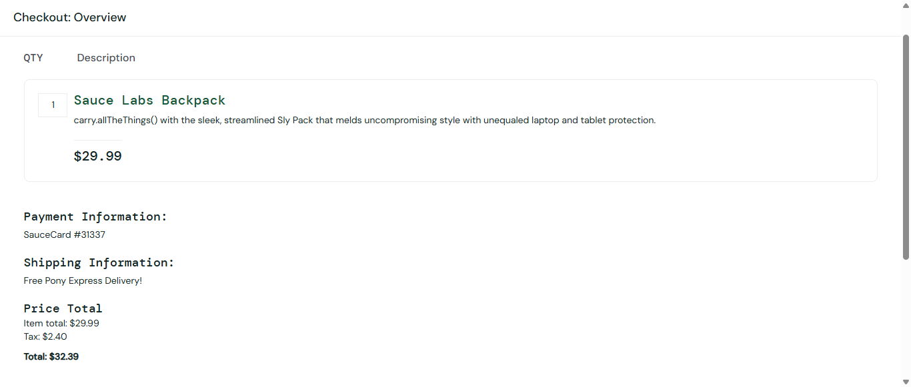
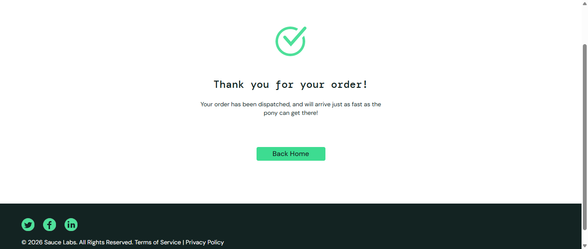

# Aut-qa

## 🎯 O Desafio
Projeto focado em testes automatizados de interface (UI) simulando cenários reais de um e-commerce.

### ⚙️ Escopo de Testes:
- **Nível 1 (Obrigatório):** Login dinâmico, ordenação/filtros, fluxo de compra completo, carrinho e logout.
- **Nível 2 (Diferencial):** Responsividade, Acessibilidade e automação robusta.

Este repositório contém testes automatizados para o site Sauce Demo, incluindo login, compra, carrinho e checkout.

## Screenshots de hoje (2026-05-27)

Os screenshots abaixo foram gerados na execução de todos os cenários em `tests/` no dia 2026-05-27:

